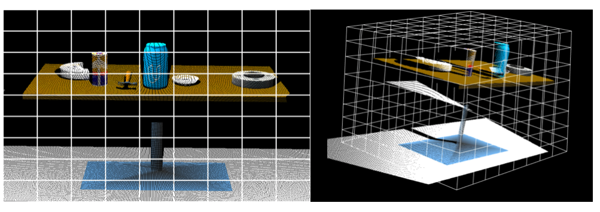
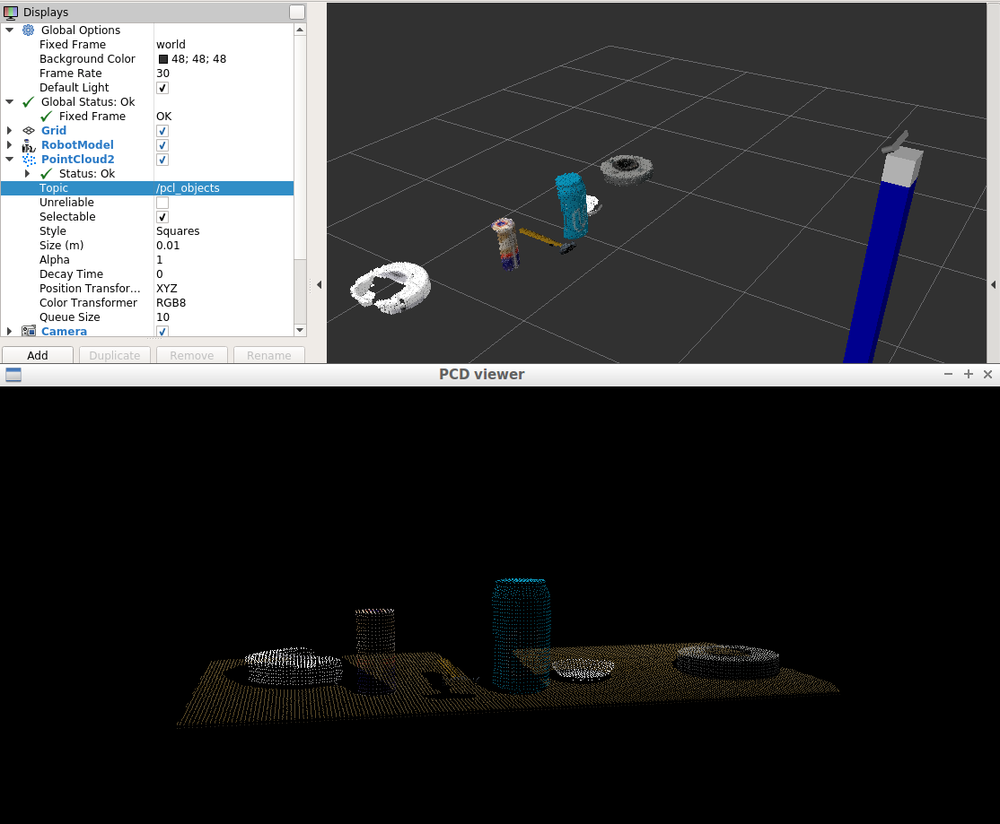
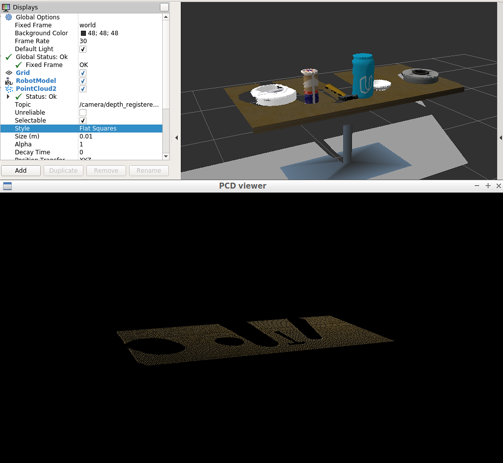
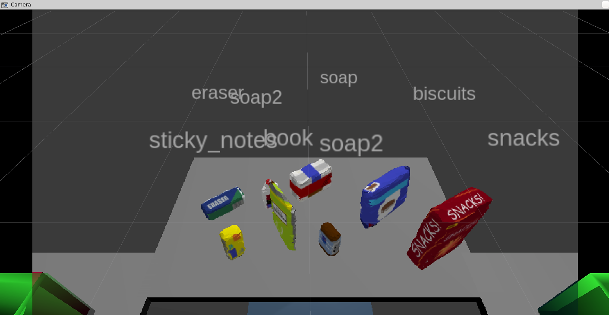

>   ## Project: 3D Perception
>
>   >   **Date:** July 15, 2018
>   >
>   >   **By:** Paul Griz
>   >
>   >   Project Submission for the Udacity Robotics Software Engineer Nanodegree

[](https://www.udacity.com/robotics)

---

## Perception Pipeline: Exercises 1, 2 and 3

>   [Link to repo containing the exercises](https://github.com/udacity/RoboND-Perception-Exercises)

#### VoxelGrid Downsampling Filter

RGB-D cameras provide detailed features and dense point clouds resulting in potentially a multitude of points in per unit volume. Using [Big-O Notation](https://en.wikipedia.org/wiki/Big_O_notation), Computing point cloud data is on a  for . So, the time required for processing a point cloud is linear to number of points (resolution). However, increasing the resolution is processing time may not yield any improvements. An optimal situation for this problem is finding the lowest  for a given accuracy. To accomplish this, I "down-sampled" the data by applying a VoxelGrid Downsampling Filter to derive a point cloud with the lowest  while maintaining the accuracy required in representing the input point cloud.

|     |
| :------------------------------------------------------: |
| *Figure from Udacity's "Voxel Grid Downsampling" Lesson* |

The figure above displays a 2D & 3D perspective of an example environment.

-   In 2D perspectives, the term "pixel" short for "picture element," and , where  as the height &  as the width.
-   In 3D perspectives, the term "voxel" is short for "volume element," and , where  is the depth &  is the size of a single voxel.

A voxel grid filter downsamples the data by increasing the 

```python
vox = outlier_filtered.make_voxel_grid_filter()
LEAF_SIZE = 0.0165
vox.set_leaf_size(LEAF_SIZE, LEAF_SIZE, LEAF_SIZE)
vox_filtered = vox.filter()
```

#### Passthrough Filter

>   [Link to Official Passthrough Filter Example](https://github.com/strawlab/python-pcl/blob/3e04e89169bbe15904a03aae6c76b1f4dc20cca5/examples/official/Filtering/PassThroughFilter.py) from python-pcl

Applying a passthrough filter to a 3D point cloud is similar to cropping a photo.

The passthrough filter crops values outside of an input range. The range is specified for each axis with cut-off values along that axis.

PR2 robot's orientation (in the simulation) only required passthrough filters along the Y and Z axis.

-   Along the  axis a range of  was applied.
-   Along the  axis a range of  was applied.

```python
# PassThrough Filter to remove the areas on the side of the table
#	(The Y axis)
passthrough_y = filtered_passthrough_z.make_passthrough_filter()
filter_axis = 'y'
passthrough_y.set_filter_field_name(filter_axis)
y_axis_min = -0.425
y_axis_max = 0.425
passthrough_y.set_filter_limits(y_axis_min, y_axis_max)
# Filter results from PassThrough along the Y Axis
filtered_passthrough_y = passthrough_y.filter()

# PassThrough Filter to isolate only the objects on the table surface
#	(The Z axis)
passthrough_z = vox_filtered.make_passthrough_filter()
filter_axis = 'z'
passthrough_z.set_filter_field_name(filter_axis)
z_axis_min = 0.59
z_axis_max = 1.05
passthrough_z.set_filter_limits(z_axis_min, z_axis_max)
# Filter results from PassThrough along the Z Axis
filtered_passthrough_z = passthrough_z.filter()
```

|  |
| :--------------------------------: |
|    *Passthrough Filter Results*    |

#### RANSAC Plane Segmentation

Simple to how [Regression Analysis](https://en.wikipedia.org/wiki/Regression_analysis) finds the relationships among variables, [Random Sample Consensus (RANSAC)](https://en.wikipedia.org/wiki/Random_sample_consensus) will return a model containing inliers and outliers.

| [](https://en.wikipedia.org/wiki/File:Fitted_line.svg) |
| :----------------------------------------------------------: |
| *Fitted line with RANSAC; outliers have no influence on the result. Credit: [Wikipedia](https://en.wikipedia.org/wiki/Random_sample_consensus)* |

RANSAC is a powerful tool for isolating/identifying objects in computer vision projects. For this project, RANSAC was used to identify the table.

```python
seg = cloud_filtered.make_segmenter()
seg.set_model_type(pcl.SACMODEL_PLANE)
seg.set_method_type(pcl.SAC_RANSAC)
max_distance = 0.01
seg.set_distance_threshold(max_distance)
inliers, coefficients = seg.segment()

# Table
cloud_table = cloud_filtered.extract(inliers, negative=False)
# Objects
cloud_objects = cloud_filtered.extract(inliers, negative=True)
```

The extracted inliers includes the table. It looks like this:

|  |
| :--------------------: |
|    *RANSAC Results*    |

#### Euclidean Clustering

With the table's point cloud now separated from the objects, the objects need to be individually separated. To separate each object, the **Density-based spatial clustering of applications with noise** [(DBSCAN)](https://en.wikipedia.org/wiki/DBSCAN) clustering algorithm was used.

| [](https://en.wikipedia.org/wiki/File:DBSCAN-Illustration.svg) |
| :----------------------------------------------------------: |
| *Credit: [Wikipedia](https://en.wikipedia.org/wiki/DBSCAN)*  |

DBSCAN forms clusters by grouping points within an input threshold distance from said point's nearest neighbors.

```python
clusters = white_cloud.make_EuclideanClusterExtraction()
# Set tolerances for distance threshold
clusters.set_ClusterTolerance(0.0235)
clusters.set_MinClusterSize(25)
clusters.set_MaxClusterSize(300)
# Search the k-d tree for clusters
clusters.set_SearchMethod(tree)
# Extract indices for each of the discovered clusters
cluster_indices = clusters.Extract()
```

|                   |
| :-------------------------------------: |
| *DBSCAN / Euclidean Clustering Results* |

#### Object Recognition

TODO FILE SPELL CHECK: To accomplish object recognition, I edited the `./training/capture_features.py` to capture features of each object from `160` random positions each.

The features (output from `capture_features.py`) were then used to train a Support Vector Machine [(SVM)](https://en.wikipedia.org/wiki/Support_vector_machine) to characterize the parameter space of the features into named objects. The SVM uses the [`svm.LinearSVC`](http://scikit-learn.org/stable/modules/generated/sklearn.svm.LinearSVC.html#sklearn.svm.LinearSVC) Class from the [scikit-learn](http://scikit-learn.org/stable/index.html) Python library.

|  |
| :------------------------------: |
|        *Training Results*        |

---

### Running the Simulation

1.  Open two terminals.
2.  In both terminals: `cd ~/catkin_ws/src/RoboND-Perception-Project/pr2_robot `
3.  In the first terminal: `roslaunch pr2_robot pick_place_project.launch test_scene_num:=1 `
    1.  *Note:* `test_scene_num` will load scenes [1, 2, or 3].
    2.  Example for scene 3:  `roslaunch pr2_robot pick_place_project.launch test_scene_num:=3`
4.  Wait for `gazibo` & `Rviz` to finish loading.
5.  In the second terminal: `rosrun pr2_robot project.py `
    1.  *Note:* Make sure you are within in the correct directory (see step 2).

---

### Results

|  |
| :-----------------------------: |
|           **Scene 1**           |
| Results: 33 Objects Detected |

|  |
| :-----------------------------: |
|           **Scene 2**           |
| Results: 55 Objects Detected |

|  |
| :-----------------------------: |
|           **Scene 3**           |
| Results: 88 Objects Detected |

**Note:** The `.yaml` output files for scenes 1, 2, and 3 are within the `output` directory.

---

### Possible improvements:

1.  Complete the collision mapping challenge by using the `pick_place_server` to execute the pick and place operation.
2.  Further Improve the SVM's training accuracy.
3.  Divide operates in the perception pipeline into separate methods to effectively time and improve operations that require excess computation.
